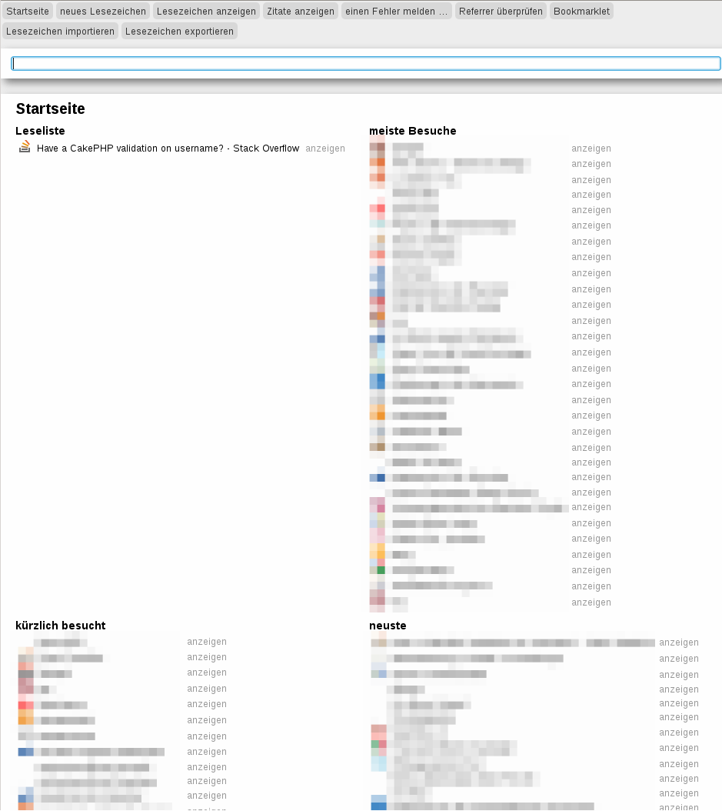

.. Copyright © 2012-2013, 2017 Martin Ueding <dev@martin-ueding.de>
.. Licensed under the MIT License (http://www.opensource.org/licenses/mit-license.php).

#########
cakemarks
#########

cakemarks is a single user bookmark web application using `CakePHP
<http://cakephp.org>`_.

It can store your bookmarks and offers a page which shows you the most relevant
of your bookmarks.

Why?
====

Bookmarks are nice to have across all your devices and browsers, but there is
hardly a bookmark syncing tool that covers all of them. Some of these tools are
restricted to a certain browser or do not support one of your browsers. Since
this is just a webpage, this problem does not arrive. The integration in your
browser is not as close, but this enables cakemarks to work with virtually
every browser.

Functions
=========

- Management of bookmarks for a single user.
- Assigning keywords to each bookmark.
- Ordering the keywords in an arbitrary tree structure.
- Quick search for bookmarks from the main page (AJAX powered).
- Import and export as JSON.

Requirements
============

-  MySQL
-  PHP
-  Webspace

License
=======

Licensed under MIT license, just like CakePHP itself.
